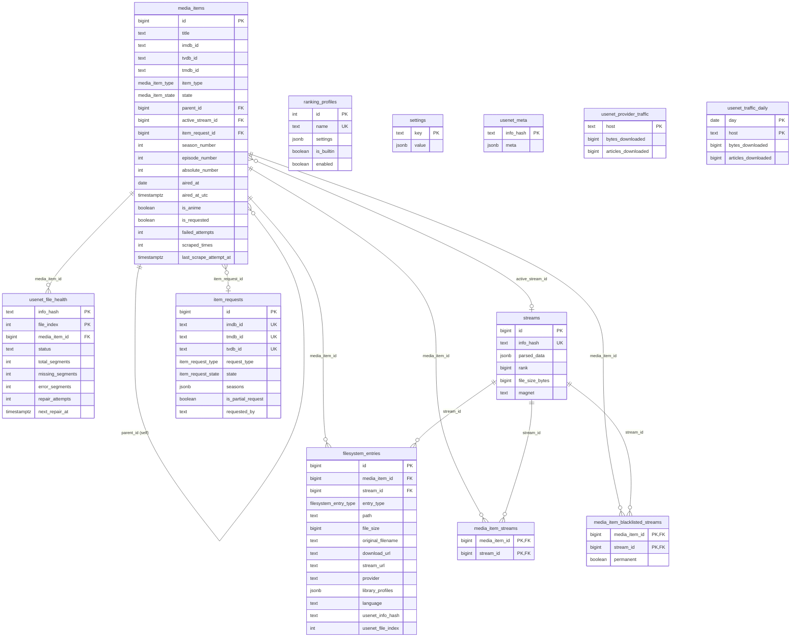

# Riven Postgres Schema

Live schema of the `riven` database (`postgres:18-alpine`). Rendered as a Mermaid ER diagram.

## Enums

| Type | Values |
|------|--------|
| `media_item_type` | movie, show, season, episode |
| `media_item_state` | indexed, unreleased, scraped, ongoing, partially_completed, completed, paused, failed |
| `show_status` | continuing, ended |
| `content_rating` | G, PG, PG-13, R, NC-17, TV-Y, TV-Y7, TV-G, TV-PG, TV-14, TV-MA |
| `filesystem_entry_type` | media, subtitle |
| `item_request_type` | movie, show |
| `item_request_state` | requested, completed, failed, ongoing, unreleased, requested_additional_seasons |

> `seaql_migrations` (SeaORM migration bookkeeping) omitted from the diagram.
